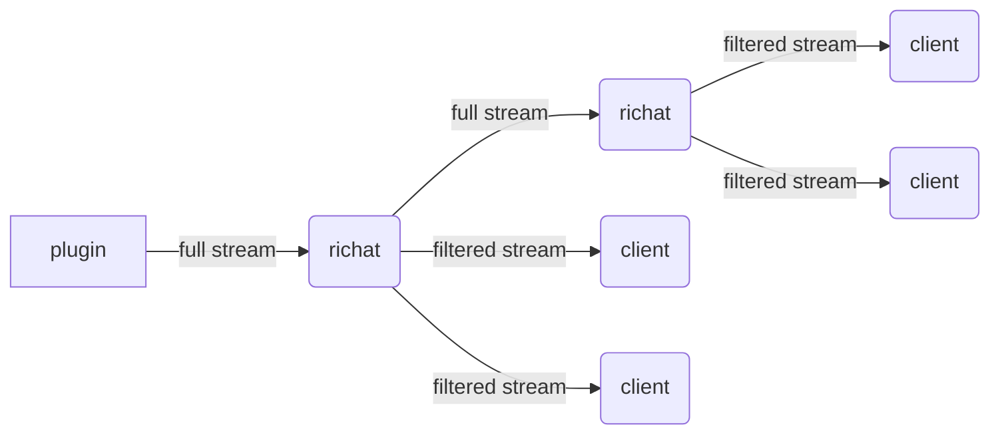
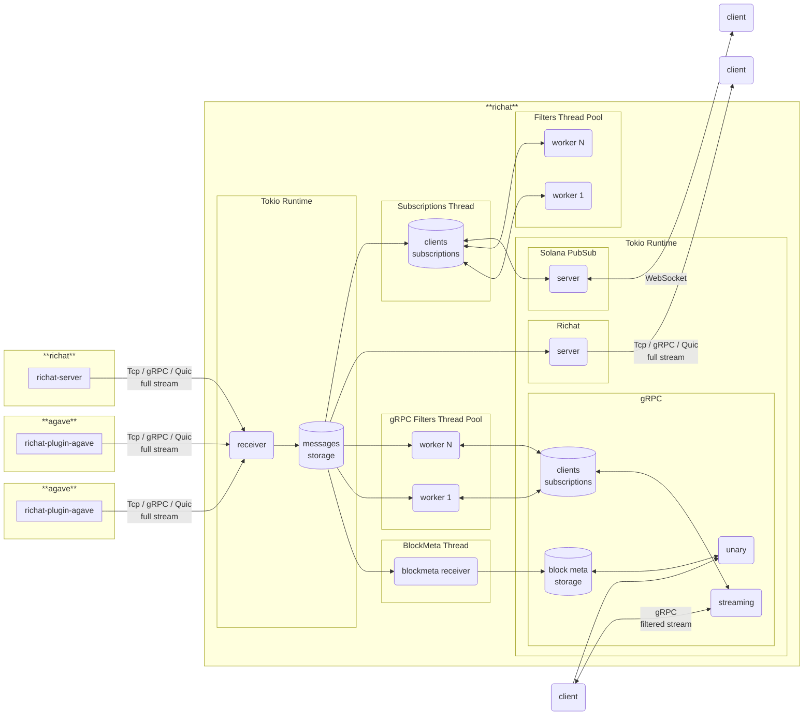

# richat

Next iteration of [Yellowstone Dragon's Mouth / Geyser gRPC](https://github.com/rpcpool/yellowstone-grpc) that was originally developed and currently maintained by [Triton One](https://triton.one/). `Richat` includes code derived from `Dragon's Mouth` (copyright `Triton One Limited`) with significant architecture changes.

In addition to `Yellowstone Drangon's Mouth / Geyser gRPC` richat includes Solana PubSub implementation.

## Sponsored by

## Licensing

The project is dual-licensed: the open-source uses the `Apache-2.0` license (`client`, `richat`, and `shared`), while everything else is licensed under the `AGPL-3.0-only`. The private version is licensed under a [commercial license](https://gist.github.com/fanatid/13f3d557c89efbf3b0c32a2d07345444#file-commercial-license-md).

## Richat support and enterprise version

Any issue not related with bugs / features related topics would be closed. If you struggle to load plugin or have some questions how to use crates please drop your question in Telegram group: [https://t.me/lamportsdev](https://t.me/lamportsdev)

In addition to open-source version there also private version with **[Prometheus](https://prometheus.io/) metrics** and ability to **downstream full stream** (with full access to code). To get more info please send email to: [customers@lamports.dev](mailto:customers@lamports.dev)



<details>
<summary>metrics example (click to toggle):</summary>

```
$ curl -s 127.0.0.1:10224/metrics
# HELP block_message_failed Block message reconstruction errors
# TYPE block_message_failed gauge
block_message_failed{reason="MissedBlockMeta"} 32
block_message_failed{reason="Total"} 32
# HELP channel_bytes_total Total size of all messages in channel
# TYPE channel_bytes_total gauge
channel_bytes_total 15254736504
# HELP channel_messages_total Total number of messages in channel
# TYPE channel_messages_total gauge
channel_messages_total 2097152
# HELP channel_slot Latest slot in channel by commitment
# TYPE channel_slot gauge
channel_slot{commitment="confirmed"} 319976982
channel_slot{commitment="finalized"} 319976952
channel_slot{commitment="processed"} 319976983
# HELP channel_slots_total Total number of slots in channel
# TYPE channel_slots_total gauge
channel_slots_total 209
# HELP grpc_block_meta_slot Latest slot in gRPC block meta
# TYPE grpc_block_meta_slot gauge
grpc_block_meta_slot{commitment="confirmed"} 319976982
grpc_block_meta_slot{commitment="finalized"} 319976952
grpc_block_meta_slot{commitment="processed"} 319976983
# HELP grpc_block_meta_queue_size Number of gRPC requests to block meta data
# TYPE grpc_block_meta_queue_size gauge
grpc_block_meta_queue_size 0
# HELP grpc_requests_total Number of gRPC requests per method
# TYPE grpc_requests_total gauge
grpc_requests_total{method="get_slot",x_subscription_id=""} 1
grpc_requests_total{method="subscribe",x_subscription_id=""} 1
# HELP grpc_subscribe_cpu_seconds_total CPU consumption of gRPC filters in subscriptions
# TYPE grpc_subscribe_cpu_seconds_total gauge
grpc_subscribe_cpu_seconds_total{x_subscription_id=""} 4.828066549975842
# HELP grpc_subscribe_messages_count_total Number of gRPC messages in subscriptions by type
# TYPE grpc_subscribe_messages_count_total gauge
grpc_subscribe_messages_count_total{message="ping",x_subscription_id=""} 62
grpc_subscribe_messages_count_total{message="slot",x_subscription_id=""} 1400
# HELP grpc_subscribe_messages_bytes_total Total size of gRPC messages in subscriptions by type
# TYPE grpc_subscribe_messages_bytes_total gauge
grpc_subscribe_messages_bytes_total{message="ping",x_subscription_id=""} 992
grpc_subscribe_messages_bytes_total{message="slot",x_subscription_id=""} 49106
# HELP grpc_subscribe_total Number of gRPC subscriptions
# TYPE grpc_subscribe_total gauge
grpc_subscribe_total{x_subscription_id=""} 0
# HELP pubsub_cached_signatures_total Number of cached signatures
# TYPE pubsub_cached_signatures_total gauge
pubsub_cached_signatures_total 56566
# HELP pubsub_connections_total Number of connections to PubSub
# TYPE pubsub_connections_total gauge
pubsub_connections_total{x_subscription_id=""} 0
# HELP pubsub_messages_sent_count_total Number of sent filtered messages by type
# TYPE pubsub_messages_sent_count_total counter
pubsub_messages_sent_count_total{subscription="account",x_subscription_id=""} 16
pubsub_messages_sent_count_total{subscription="root",x_subscription_id=""} 118
pubsub_messages_sent_count_total{subscription="slotsupdates",x_subscription_id=""} 383
# HELP pubsub_messages_sent_bytes_total Total size of sent filtered messages by type
# TYPE pubsub_messages_sent_bytes_total counter
pubsub_messages_sent_bytes_total{subscription="account",x_subscription_id=""} 4208
pubsub_messages_sent_bytes_total{subscription="root",x_subscription_id=""} 10856
pubsub_messages_sent_bytes_total{subscription="slotsupdates",x_subscription_id=""} 69399
# HELP pubsub_slot Latest slot handled in PubSub by commitment
# TYPE pubsub_slot gauge
pubsub_slot{commitment="confirmed"} 319976982
pubsub_slot{commitment="finalized"} 319976952
pubsub_slot{commitment="processed"} 319976983
# HELP pubsub_stored_messages_count_total Number of stored filtered messages in cache
# TYPE pubsub_stored_messages_count_total gauge
pubsub_stored_messages_count_total 2337
# HELP pubsub_stored_messages_bytes_total Total size of stored filtered messages in cache
# TYPE pubsub_stored_messages_bytes_total gauge
pubsub_stored_messages_bytes_total 404610
# HELP pubsub_subscriptions_total Number of subscriptions by type
# TYPE pubsub_subscriptions_total gauge
pubsub_subscriptions_total{subscription="account",x_subscription_id=""} 0
pubsub_subscriptions_total{subscription="root",x_subscription_id=""} 0
pubsub_subscriptions_total{subscription="slotsupdates",x_subscription_id=""} 0
# HELP version Richat App version info
# TYPE version counter
version{buildts="2025-02-11T15:49:26.646046121Z",git="2991f89-modified",package="richat",proto="5.0.0",rustc="1.81.0",solana="2.1.10",version="2.2.0"} 1
```
</details>

## Blueprint



## Components

- `cli` — CLI client for full stream, gRPC stream with filters, simple Solana PubSub
- `client` — library for building consumers
- `filter` — library for filtering geyser messages
- `plugin-agave` — Agave validator geyser plugin https://docs.anza.xyz/validator/geyser
- `proto` — library with proto files, re-imports structs from crate `yellowstone-grpc-proto`
- `richat` — app with full stream consumer and producers: gRPC (`Dragon's Mouth`), Solana PubSub
- `shared` — shared code between components (except `client`)

## Releases

#### Branches

- `master` — development branch
- `agave-v2.0` — development branch for agave v2.0
- `agave-v2.1` — development branch for agave v2.1

#### Tags

- `cli-v0.0.0`
- `client-v0.0.0`
- `filter-v0.0.0`
- `plugin-agave-v0.0.0`
- `plugin-agave-v0.0.0+solana.2.1.5`
- `proto-v0.0.0`
- `richat-v0.0.0`
- `richat-v0.0.0+solana.2.1.5`
- `shared-v0.0.0`

At one moment of time we can support more than one agave version (like v2.0 and v2.1), as result we can have two different major supported versions of every component, for example: `cli-v1.y.z` for `agave-v2.0` and `cli-v2.y.z` for `agave-v2.1`. In addition to standard version `plugin-agave` and `richat` can one or more tags with pinned solana version.

## List of RPC providers with Dragon's Mouth support

- `Gadfly Node` — https://gadflynode.com/
- `Geeks Labs` — https://discord.gg/geekslabs
- `GetBlock` — https://getblock.io/
- `Helius` — https://www.helius.dev/
- `InstantNodes` — https://instantnodes.io/
- `OrbitFlare` — https://orbitflare.com/
- `QuickNode` — https://www.quicknode.com/
- `Shyft` — https://shyft.to/
- `Solana Tracker` — https://www.solanatracker.io/solana-rpc
- `Triton One` — https://triton.one/
- `Urban Node` — https://urbannode.io/

If your RPC provider not in the list, please open Issue / PR!
