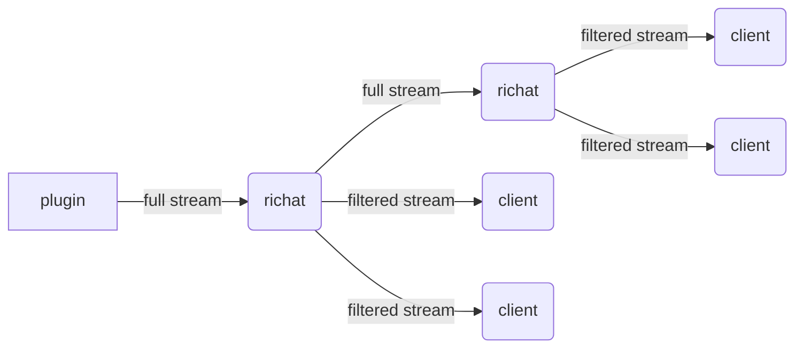
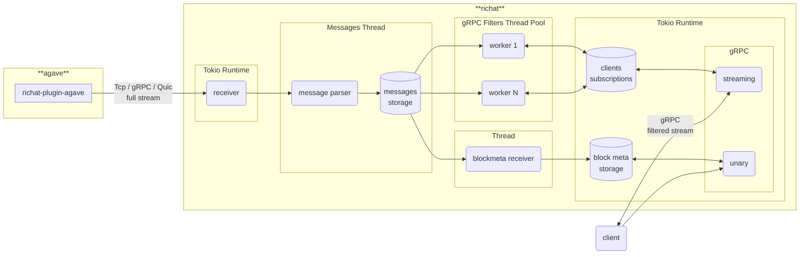

# richat

Next iteration of [Yellowstone Dragon's Mouth / Geyser gRPC](https://github.com/rpcpool/yellowstone-grpc) that was originally developed and currently maintained by [Triton One](https://triton.one/). `Richat` includes code derived from `Dragon's Mouth` (copyright `Triton One Limited`) with significant architecture changes.

## Sponsored by

## Licensing

Default license for any file in this project is `AGPL-3.0-only`, except files in next directories that licensed under `Apache-2.0`:

- `client`
- `richat`
- `shared`

## Richat support and enterprise version

Any issue not related with bugs / features related topics would be closed. If you struggle to load plugin or have some questions how to use crates please drop your question in Telegram group: [https://t.me/lamportsdev](https://t.me/lamportsdev)

In addition to open-source version there also enterprise version with **[Prometheus](https://prometheus.io/) metrics** and ability to **downstream full stream**. To get more info please send email to: [customers@lamports.dev](mailto:customers@lamports.dev)



<details>
<summary>Metrics example (click to toggle):</summary>

```
$ curl -s 127.0.0.1:10224/metrics
# HELP block_message_failed Block message reconstruction errors
# TYPE block_message_failed gauge
block_message_failed{reason="MismatchEntries"} 1
block_message_failed{reason="MismatchTransactions"} 1
block_message_failed{reason="MissedBlockMeta"} 31
block_message_failed{reason="Total"} 33
# HELP channel_bytes_total Total size of all messages in channel
# TYPE channel_bytes_total gauge
channel_bytes_total 1073739858
# HELP channel_messages_total Total number of messages in channel
# TYPE channel_messages_total gauge
channel_messages_total 183950
# HELP channel_slot Latest slot in channel by commitment
# TYPE channel_slot gauge
channel_slot{commitment="confirmed"} 315344683
channel_slot{commitment="finalized"} 315344653
channel_slot{commitment="processed"} 315344684
# HELP channel_slots_total Total number of slots in channel
# TYPE channel_slots_total gauge
channel_slots_total 36
# HELP grpc_block_meta Latest slot in gRPC block meta
# TYPE grpc_block_meta gauge
grpc_block_meta{commitment="confirmed"} 315344683
grpc_block_meta{commitment="finalized"} 315344653
grpc_block_meta{commitment="processed"} 315344684
# HELP grpc_block_meta_queue_size Number of gRPC requests to block meta data
# TYPE grpc_block_meta_queue_size gauge
grpc_block_meta_queue_size 0
# HELP grpc_requests_total Number of gRPC requests per method
# TYPE grpc_requests_total gauge
grpc_requests_total{method="get_block_height",x_subscription_id=""} 1
grpc_requests_total{method="get_slot",x_subscription_id=""} 4
grpc_requests_total{method="ping",x_subscription_id=""} 1
grpc_requests_total{method="subscribe",x_subscription_id=""} 2
# HELP grpc_subscribes_messages_total Number of gRPC messages in subscriptions
# TYPE grpc_subscribes_messages_total gauge
grpc_subscribes_messages_total{message="account",x_subscription_id=""} 267528
grpc_subscribes_messages_total{message="blockmeta",x_subscription_id=""} 57
grpc_subscribes_messages_total{message="ping",x_subscription_id=""} 6
grpc_subscribes_messages_total{message="transaction",x_subscription_id=""} 40071
# HELP grpc_subscribes_total Number of gRPC subscriptions
# TYPE grpc_subscribes_total gauge
grpc_subscribes_total{x_subscription_id=""} 0
# HELP version Richat App version info
# TYPE version counter
version{buildts="2025-01-21T03:08:45.829475407Z",git="cc2a387-modified",package="richat",proto="4.1.1",rustc="1.81.0",solana="2.1.10",version="2.0.0"} 1
```
</details>

## Blueprint



## Components

- `cli` — CLI client for full stream, gRPC stream with filters, simple Solana PubSub
- `client` — library for building consumers
- `filter` — library for filtering geyser messages
- `plugin-agave` — Agave validator geyser plugin https://docs.anza.xyz/validator/geyser
- `proto` — library with proto files, re-imports structs from crate `yellowstone-grpc-proto`
- `richat` — app with full stream consumer and producers: gRPC (`Dragon's Mouth`), Solana PubSub
- `shared` — shared code between components (except `client`)

## Releases

#### Branches

- `master` — development branch
- `agave-v2.1` — development branch for agave v2.1
- `agave-v2.0` — development branch for agave v2.0

#### Tags

- `cli-v0.0.0`
- `client-v0.0.0`
- `filter-v0.0.0`
- `plugin-agave-v0.0.0`
- `plugin-agave-v0.0.0+solana.2.1.5`
- `proto-v0.0.0`
- `richat-v0.0.0`
- `richat-v0.0.0+solana.2.1.5`
- `shared-v0.0.0`

At one moment of time we can support more than one agave version (like v2.0 and v2.1), as result we can have two different major supported versions of every component, for example: `cli-v1.y.z` for `agave-v2.0` and `cli-v2.y.z` for `agave-v2.1`. In addition to standard version `plugin-agave` and `richat` can one or more tags with pinned solana version.

## List of RPC providers with Dragon's Mouth support

- `GetBlock` — https://getblock.io/
- `Helius` — https://www.helius.dev/
- `OrbitFlare` — https://orbitflare.com/
- `QuickNode` — https://www.quicknode.com/
- `Shyft` — https://shyft.to/
- `Triton One` — https://triton.one/

If your RPC provider not in the list, please open Issue / PR!
